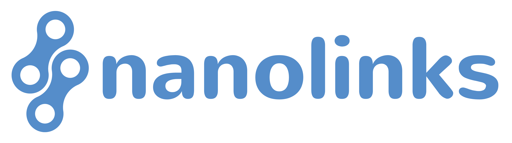

<nav id="dropdown">
  

    
    
  

  

    

      <ul>
        <li><a href="#">Top</a></li>
	<li><a href="https://translate.google.com/translate?sl=en&tl=pt&js=y&prev=_t&hl=en&ie=UTF-8&u=https%3A%2F%2Fnanolinks.info&edit-text=&act=url">Translated Site</a></li>
        <li><a href="#latest-additions">Latest Additions</a></li>
        <li><a href="#information--education">Information &amp; Education</a></li>
        <li><a href="#market">Market</a></li>
        <li><a href="#development">Development</a></li>
        <li><a href="#entertainment">Entertainment</a></li>
        <li><a href="#services">Services</a></li>
        <li><a href="#contribution">Contribution</a></li>
      </ul>
    

  

</nav>

  
No javascript detected, functionality will be limited.

  
  <button class="site-btn collapse">What is Nano?</button>
  

<strong>Nano is a 3rd generation cryptocurrency with zero fees, super quick transactions and high scalability. Each account is part of a Directed Acyclic Graph (DAG), which results in lightweight nodes that requires no mining, thus very low environmental impact. These features makes Nano ideal for peer-to-peer transactions, donations and purchases in everyday life all around the world! Feel free to browse this page to know more about Nano, how it can be used and how to obtain it.</strong>

<h3><strong>Simple Comparison</strong></h3>
<table id="intro-table">
  <tr>
    <th>Coin</th>
    <th>Fee</th>
    <th>Speed [Sec]</th>
    <th>Scalability [TPS]</th>
    <th>Energy [Wh/Tx]</th>
  </tr>
  <tr>
    <td>Nano</td>
    <td>0*1</td>
    <td>0.3*3</td>
    <td>100-1000*5</td>
    <td>0.032*7</td>
  </tr>
  <tr>
    <td>Bitcoin</td>
    <td>Fee market*2</td>
    <td>600-3600*4</td>
    <td>10*6</td>
    <td>950,000*8</td>
  </tr>
  <tr>
    <td><strong>Multipliers</strong></td>
    <td><strong>Infinite</strong></td>
    <td><strong>2000-12000x</strong></td>
    <td><strong>10-100x</strong></td>
    <td><strong>1/30,000,000x</strong></td>
  </tr>
</table>

  
*1 No mining, no fees.

  
*2 Typically around 0.1-1 USD/transaction but was $37 while the network was saturated. No upper limit and controlled by demand.

  
*3 Median time of sending from node A until detected confirmed and fully settled on node B. As of Jul 2019, node v19. PoW not included but that is mostly precalculated before sending.

  
*4 Depends on the fee. A high fee typically results in transactions to be cleared in 10min but with lower fee take 1h or more.

  
*5 Only limited by node hardware. 7000 TPS was done in early lab. No real test on mainnet has been made yet but will be as soon as planned protocol optimizations have been done. 100 TPS has already been seen on the network.

  
*6 Estimated hardcoded maximum allowed per block with Segwit.

  
*7 Mid 2018 value based on PoW needed for each tx. Reference: GTX1070 GPU at 100W + 100W computer.

  
*8 Mid 2018 value. Depends on hashrate which depends on market. Also depends of current tps.

 
<h3><strong>The Green Choice</strong></h3>

<ul>
  <li>A Vestas V164 wind turbine can power 400,000 nano transactions, per revolution! Enough to power 80,000 tx/sec</li>
  <li>4 square meters of solar panels can power 7 tx/sec</li>
  <li>1 nano tx is equivalent of a 2W LED lamp to shine for 1 sec</li>
</ul>

 
<h3><strong>Test Nano</strong></h3>

  
Without the need to own any nano you can try the power of fast and fee-less transactions on the real live network! 
	  If you want to transact with your own nano you can easily create a wallet and obtain some free nano from any of the faucets found below.

  <a href="http://nanospeed.live" class="site-btn btn-wide btn-external site-btn-space" onclick="window.open(this.href); return false;">SPEED TEST FROM A TO B</a> 
  <a href="#faucets-free-nano" class="site-btn btn-wide site-btn-space">GET FREE NANO</a> 
  <a href="https://nanomate.co/" class="site-btn btn-wide btn-external site-btn-space" onclick="window.open(this.href); return false;">SEND TO ANYONE</a> 
  <a href="https://www.reddit.com/r/nano_tipper/wiki/index" class="site-btn btn-wide btn-external" onclick="window.open(this.href); return false;">REDDIT TIPPING</a>

  <h2 id="quick-index">Quick Index</h2>
  <ul>
    <li><a class="int-link" href="/news">News Archive</a></li>
    <li><a class="int-link" href="https://translate.google.com/translate?sl=en&tl=pt&js=y&prev=_t&hl=en&ie=UTF-8&u=https%3A%2F%2Fnanolinks.info&edit-text=&act=url">Google Translate This Site</a></li>
    <li><a class="int-link" href="#latest-additions">Latest Additions</a></li>
    <li><a class="int-link" href="#information--education">Information &amp; Education</a></li>
    <li><a class="int-link" href="#market">Market</a></li>
    <li><a class="int-link" href="#development">Development</a></li>
    <li><a class="int-link" href="#entertainment">Entertainment</a></li>
    <li><a class="int-link" href="#services">Services</a></li>
    <li><a class="int-link" href="#contribution">Contribution</a></li>
  </ul>

  <select id="help-select">
    <option selected disabled>What are you looking for?</option>
    <option value="1">Send or Receive Nano</option>
    <option value="2">Buy or Trade Nano</option>
    <option value="3">Track Transactions or check Stats</option>
    <option value="4">Accept Nano in a Shop</option>
    <option value="8">Purchase products with Nano</option>
    <option value="5">Set up a Node or Representative</option>
    <option value="6">Participate in the Beta Network</option>
    <option value="7">Join our Community</option>
  </select>

  

    <ul>
      <li><a class="int-link" href="#wallets">Wallets</a></li>
      <li><a class="int-link" href="#faucets-free-nano">Faucets (Free nano)</a></li>
      <li><a href="https://youtu.be/qSsIXy-NimE">Video Guide: Get Free Nano and Share with Anyone</a></li>
      <li><a href="https://youtu.be/5K8rRISz4RU">Video Demo: Transaction speed mobile to mobile</a></li>
    </ul>
  

  

    <ul>
      <li><a class="int-link" href="#exchanges">Exchanges</a></li>
      <li><a class="int-link" href="#related-mobile-apps">Mobile Apps</a></li>
      <li><a class="int-link" href="#market-data-analysis--tickers">Market Data, Analysis & Tickers</a></li>
      <li><a href="https://youtu.be/FE5yUT4-UYk">Guide: How to buy NANO with Coinbase and Binance</a></li>
    </ul>
  

  

    <ul>
      <li><a class="int-link" href="#network-stats-and-explorers">Network Stats and Explorers</a></li>
      <li><a href="https://dpow.nanocenter.org/">Distributed PoW System - Dashboard</a></li>
    </ul>
  

  

    <ul>
      <li><a class="int-link" href="#merchant--donation-related-no-shops-too-many">Payment Services</a></li>
      <li><a class="int-link" href="#point-of-sale">Point of Sale Services</a></li>
    </ul>
  

  

    <ul>
      <li><a href="https://youtu.be/k1RlrlaKOCg">Video Guide: How to setup a Nano node</a></li>
      <li><a href="https://1nano.co/support-the-network">Text Guide: How to Setup a Node at DigitalOcean</a></li>
      <li><a href="https://github.com/nanocurrency/nano-node/wiki">Nano Main Github Wiki</a></li>
      <li><a href="https://nanoo.tools/docker-node">Community Developer Wiki</a></li>
      <li><a href="https://github.com/lephleg/nano-node-docker">Quick Setup: Nano Node Docker</a></li>
      <li><a href="https://nanotools.github.io/easy-nano-node">Quick Setup: Easy Nano Node</a></li>
      <li><a href="https://github.com/NanoTools/nanoNodeMonitor">Nano Node Monitor</a></li>
      <li><a href="https://github.com/Joohansson/NanoNodeGraphics">Nano Node Graphics - Realtime Charts</a></li>
      <li><a href="https://github.com/georgehara/nano/wiki/unofficial">Advanced Community Documentation</a></li>
    </ul>
  

  

    <ul>
      <li><a class="int-link" href="#beta-network">Beta Network Resources</a></li>
    </ul>
  

  

    <ul>
      <li><a class="int-link" href="#core-social-media--contribution-channels">Social Media Channels</a></li>
      <li><a class="int-link" href="#project-specific-development-channels">Development Channels</a></li>
      <li><a href="https://nanocenter.org/">The Nano Center</a></li>
    </ul>
  

  

    <ul>
      <li><a href="https://usenano.org/">Use Nano - Merchant Directory</a></li>
    </ul>
  

## Latest Additions
* [Oct 09: DragonEx](https://dragonex.io/)
* [Sep 26: Appia Manta - Python](https://github.com/appiapay/manta-python)
* [Sep 25: OneFastWay - Betting](https://onefastway.com)
* [Sep 22: Miner.host - Mining Pool, Pays NANO](https://miner.host/)
* [Sep 18: Nano Infographics](https://imgur.com/a/tPaK9hp)
* [Sep 10: Metalpay cryptocurrency marketplace](https://www.metalpay.com/)
* [Sep 05: NanoQuake JS](http://nanoquakejs.com)
* [Sep 05: MoonPos - Mobile PoS](https://www.moonposapp.com/)
* [Sep 02: Colin LeMahieu Interviewed on Crypto Finder](https://www.reddit.com/r/nanocurrency/comments/cykjl3/colin_interviewed_on_cryptofindertv_very_solid/)
* [Aug 29: Nanocean - Explorer, Stats, Account list](https://nanocean.org)

## Information & Education
Learn everything there is to know about Nano!

### Core Team

* [Main Site - nano.org](https://nano.org)
* [Full Documentation, Roadmap, Integration guides](https://docs.nano.org/)
* [Whitepaper (Eng)](https://nano.org/en/whitepaper)
* [Official Nano GitHub Wiki](https://github.com/nanocurrency/raiblocks/wiki)
* [Medium Channel - Main](https://medium.com/@nanocurrency)
* [Medium Channel - The Nano Center](https://medium.com/the-nano-center)
* [Nano Development Fund](https://nanocrawler.cc/explorer/account/xrb_1ipx847tk8o46pwxt5qjdbncjqcbwcc1rrmqnkztrfjy5k7z4imsrata9est/history)

### Core Social Media & Contribution Channels
* [Reddit](https://www.reddit.com/r/nanocurrency/)
* [Discord: Nano Main (Info, Support, Integrations, News)](https://discordapp.com/invite/JphbBas)
* [Discord: The Nano Center (Community projects, Trade talk, Gaming](http://discord.nanocenter.org/)
* [Twitter](https://twitter.com/nano)
* [Facebook](https://www.facebook.com/nanofoundation/)
* [LinkedIn](https://www.linkedin.com/company/nano-foundation/)
* [Instagram](https://www.instagram.com/nanocurrency/)
* [Telegram](https://t.me/nanocurrency)
* [Telegram China](https://t.me/NanoCN)

### Scientific Papers
* [Distributed Ledger Technology: Blockchain Compared to Directed Acyclic Graph](https://www.researchgate.net/publication/324793344_Distributed_Ledger_Technology_Blockchain_Compared_to_Directed_Acyclic_Graph)
* [Scalability of the Bitcoin and Nano
protocols: Comparison](http://www.diva-portal.org/smash/get/diva2:1229650/FULLTEXT02.pdf)

### Education & Adoption
* [Nano Guide - Getting started](http://nano-guide.com/)
* [Nano Guide 2 - Getting Started](https://gettingstarted.nanocenter.org/)
* [What is Nano - A Great Summary](https://medium.com/coinplan-insights/coin-spotlight-nano-2c111170a19f)
* [Learn Nano](https://learnnano.com/)
* [Guide - Get, Use, Accept & Support Nano](https://1nano.co/)
* [Nano4mythoughts - A blog centered around Nano adoption](https://www.nano4mythoughts.com)
* [Informative Medium Articles - Nano Education](https://medium.com/nano-education)
* [Informative Medium Articles - Colin LeMahieu (Founder)](https://medium.com/@clemahieu)
* [Informative Medium Articles - Bruno Garcia (Community Manager)](https://medium.com/@brunoerg)
* [Informative Medium Articles - Audrey Helpburn (Crypto Copywriter)](https://steemit.com/@audreyhelpburn)
* [Informative Medium Articles - James Coxon](https://medium.com/@jacoxon)
* [Guide: How to secure your Nano](https://medium.com/@d84/how-to-secure-your-cryptocurrency-nano-7a83b194e474)
* [Best Practices When Using a Hardware Wallet](https://medium.com/ledger-on-security-and-blockchain/ledger-101-part-3-best-practices-when-using-a-hardware-wallet-198b60df2681)
* [HelpNano - Guide for how to help the Nano ecosystem](https://helpnano.org/)
* [Nano Infographics](https://imgur.com/a/tPaK9hp)

#### External Media
* [Colin LeMahieu joins the @Crypto101Pod podcast](https://soundcloud.com/crypto101podcast/from-the-archive-nano-and-holochain)
* [Emerging Economies Are Our Target Market: Nano Founder Colin LeMahieu](https://cryptobriefing.com/nano-adoption-target-market/)
* [Third Generation Cryptocurrencies](https://hackernoon.com/why-third-generation-cryptocurrencies-are-game-changers-for-venezuela-cb8c9b016f9d)

#### Adoption
* [Kappture: Accepting cryptocurrency at the point-of-sale](https://www.kappture.co.uk/files/accepting-cryptocurrency-at-the-point-of-sale.pdf)

#### Targeted Countries
* [Venezuela 1](https://nano.org.ve/)
* [Venezuela 2](http://www.nanovenezuela.org/)
* [Nano China](https://nanochina.co/)
* [Chinese information and news](http://www.nano.wang/)
* [Chinese forum](https://www.chainnode.com/forum/349)
* [Brazil Facebook Group](https://www.facebook.com/groups/RaiBlocksBrasil/)

### Video Channels
* [Nano](https://www.youtube.com/channel/UCFxXo3z9k4yvxSboEEjXO2w)
* [Nano Basics](https://www.youtube.com/channel/UCGYBwp3HtfUoXbwL4NtiV3Q)
* [NanoCast](https://www.youtube.com/channel/UC_KCdNCWQcb5Z4vsPBY18yQ)
* [The Nano Center](https://www.youtube.com/channel/UCwB_g6LBPGv_anMhywH4BWA)
* [Jolt Wallet](https://www.youtube.com/channel/UCLfilzzY4NmwNjWtEIibdkA)
* [Brainblocks](https://www.youtube.com/channel/UCToyZ7QLqVX9mHWPTM8MNwg)
* [Patrick Luberus - Nano Education](https://www.youtube.com/user/PatrickLuberus/videos)

### Interesting Videos [Not in channels above]
* [Transaction Speed Demo - Mobile to Mobile](https://youtu.be/5K8rRISz4RU)
* [Transaction Speed Demo - Confirmation Node to Node](https://youtu.be/R6oxmQaiFJI)
* [Colin LeMahieu Interviewed on Crypto Finder Sep 02](https://www.reddit.com/r/nanocurrency/comments/cykjl3/colin_interviewed_on_cryptofindertv_very_solid/)
* [Colin LeMahieu Interviewed by The Crypto Lark Feb 18](https://youtu.be/hAy4GDV7tvQ)
* [Colin LeMahieu Interviewed by DataDash Oct 18](https://youtu.be/eWdOkIev_xM)
* [Colin LeMahieu Audio interviewed by Crypto101 (Start at 13min)](https://soundcloud.com/matthew-aaron-690749808/from-the-archive-nano-and-holochain)
* [Everything you need to know about Nano](https://youtu.be/ywgMlJBli7g)
* [Nano simply explained](https://youtu.be/dlRhUwLQWXc)
* [Nano explained (Deep dive)](https://youtu.be/LcqPLlduE0w)
* [Nano explained (Another deep dive)](https://youtu.be/1ciokw6ZQvE)
* [Nano Development 2014-2018](https://youtu.be/br8tcS8gcqE)
* [Nano Development 2018](https://www.youtube.com/watch?v=FqLe12zJKEE)
* [Why Change Your Nano Representative?](https://youtu.be/dnOTiixhPrk)
* [Guide: How to setup a Nano node](https://youtu.be/k1RlrlaKOCg)
* [Guide: Get Free Nano and Share with Anyone with Zero Fees](https://youtu.be/qSsIXy-NimE)
* [Guide: How to buy NANO with Coinbase and Binance](https://youtu.be/FE5yUT4-UYk)
* [NanoBrewed - Beer dispensing for nano](https://youtu.be/UfLqHz5Ls-g)

### Video Advertisement
* [Nano The Future of Money](https://youtu.be/lw-rpO0jqYQ)
* [Nano Overview](https://youtu.be/JynwiU2D_K0)
* [Nano is Green](https://youtu.be/JChBTohSHlM)

### Network Stats and Explorers
* [NanoCrawler.cc - Explorer, Stats, Account list](https://nanocrawler.cc/)
* [Nanode.co - Explorer, Stats](https://www.nanode.co/)
* [Nano-Faucet.org - Explorer, Stats, Visualizer, Map, Account list](https://nano-faucet.org/visualizer/)
* [Repnode.org - Explorer, Stats, Reps, Network speed](https://repnode.org/)
* [My Nano Ninja - Representatives, Stats, Explorer](https://mynano.ninja/)
* [Nanocean - Explorer, Stats, Account list](https://nanocean.org)
* [Nanoticker - Nano Network Analytics & Performance](https://nanoticker.info/)
* [NANOODLE - Explorer,  Fiat Tracker, Stat Charts, Account Alerting](https://nanoodle.io/live)
* [Nanoverse - Visual Explorer](https://nanoverse.io/)
* [Cryptolights - Flow Visualizer](https://cryptolights.info/)
* [TX Highway - Nano Vs BTC Visualizer](https://bitdesert.github.io/txhighway-nano/)
* [NanoStream - Transaction Visualizer](https://nanostream.eu/)
* [Blocktivity - Utilization Comparision](https://blocktivity.info/)
* [Nano Charts - Representative stats](https://nanocharts.info/)
* [Nano SpeedTest - Test real nano transactions](https://nanospeed.live)
* [Transaction Speed Demo Button](https://speed.nanolinks.info/)
* [Main & Beta Net Confirmation Time](https://nano.observer/)
* [NanoFees - Fee Tracker](http://nanofees.info/)
* [Reddit Tip Bot Stats](http://reddittipbot.com/)
* [Crypto Subreddit Tracker](https://cryptosub.live/)
* [Nanocurrency Reddit Stats](https://subredditstats.com/r/nanocurrency)

## Market
Are you ready to obtain or spend some Nano? Find your market or merchant here.

### Exchanges

#### Traditional Exchanges
* [Binance](https://www.binance.com)
* [KuCoin](https://www.kucoin.com)
* [OkEx](https://www.okex.com/)
* [Huobi](https://www.huobi.com/en-us/)
* [Mercatox](https://mercatox.com/)
* [Bitflip](https://bitflip.li/)
* [Cryptowolf](https://cryptowolf.eu/)
* [RightBTC](https://www.rightbtc.com)
* [Bit-Z](https://www.bit-z.com/)
* [Coindeal](https://coindeal.com/)
* [Gate.io](https://gate.io/)
* [Koinex](https://koinex.in/)
* [Coinbene](https://www.coinbene.com)
* [Bitinka](https://www.bitinka.com)
* [Bitladon](https://www.bitladon.com/nano)
* [Coinall](https://www.coinall.com/market?product=nano_btc)
* [Txbit](https://txbit.io/)
* [Bitturk](https://bitturk.com/)
* [Qtrade](https://qtrade.io)
* [Wazirx](https://wazirx.com/)
* [DragonEx](https://dragonex.io/)

#### Quick Crypto Swap/Buy
##### Simple way but normally a bit worse exchange rate than a large exchange and often includes fees. Use with common sense and caution.

* [Wirex - Visa payment card, fiat on/off ramp](https://wirexapp.com/)
* [Coingate](https://coingate.com/buy/nano)
* [Uphold](https://uphold.com/)
* [Crypto.com](https://crypto.com)
* [Metalpay](https://www.metalpay.com/)
* [N.Exchange](https://n.exchange/)
* [Swaplab](https://swaplab.cc/)
* [FastX](https://fastx.io/)
* [One Page Exchange](https://onepagex.com)
* [Cryptowolf](https://cryptowolf.eu/)
* [Coinsave](https://coinsave.io/)
* [Nanotrade.co.uk](https://nanotrade.co.uk/)
* [SimpleSwap.io](https://simpleswap.io/)
* [changeNOW.io](https://changenow.io/?to=nano)
* [Elastum.io - European Gateway](https://elastum.io/)
* [Bitvavo - European Gateway](https://bitvavo.com/en)
* [Lex.Exchange - Australian Gateway](https://lex.exchange/)

#### Escrow and Peer-to-peer
* [Localnano](https://www.localnano.com/)
* [PayFair](https://payfair.io/)

### Wallets
* [**Natrium** - Android,iOS](https://natrium.io/)
* [**Canoe** - OSX,Win,Linux,iOS,Android,WinPhone](https://getcanoe.io/)
* [**Nanovault** - Web,Linux,Mac](https://nanovault.io/)
* [**Ninjavault** - Web](https://vault.mynano.ninja/)
* [**Nanovault #2** - Web](https://vault.nanocrawler.cc/)
* [**Nanovault #3** - Web](https://vault.nifni.net)
* [**Nanowallet** - Web](https://nanowallet.io/)
* [**Brainblocks** - Web](https://app.brainblocks.io/)
* [**Nanollet** - Windows,Linux,Darwin](https://nanollet.org/)
* [**Nanoblocks** - iOS](https://itunes.apple.com/us/app/nano-blocks/id1378558905?ls=1&mt=8)
* [**Nano Wallet Company** - OSX,Win,Linux,iOS,Android](https://nanowalletcompany.com/)

#### Multi Asset Wallets
* [**Hodler** - Android, Win, Linux](https://hodler.tech/)

#### Address Generators, Paper Wallets
* [NanoPaperWallet.com](https://nanopaperwallet.com/)
* [Paper Wallet Generator (vitorcremonez)](https://vitorcremonez.github.io/nano-paper-wallet/)
* [Nano Gift - Gift Card and Paper Wallet Generator](https://nanogift.me)
* [RaiPaper](https://blootoon.github.io/rai-paper/)
* [Rai Paper Wallet](https://numtel.github.io/rai-paper-wallet/)
* [Nano Warp Wallet](https://termhn.github.io/nanowarpwallet/)
* [Dropil - Graphical Templates](https://paper.dropil.com)
* [Secure Seed Commands - How to Generate Seeds in various OS](https://www.secureseedcommands.com)

#### Hardware Wallets and Nodes
* [Ledger Nano S](https://www.ledger.fr/)
* [Ledger Nano - Text Guide](http://blog.nanovault.io/guides/use-your-ledger-device-with-nanovault/)
* [Ledger Nano - Video Guide](https://youtu.be/OoTfRjXsxNk)
* [How to transfer Nano from a Ledger Nano recovery phrase using offline signing](https://medium.com/@d84/how-to-transfer-nano-from-a-ledger-nano-recovery-phrase-using-offline-signing-33e5da9ef94b)
* [Jolt](https://www.joltwallet.com/)

### Related Mobile Apps
* [Nano Track - Nano Ticker](https://itunes.apple.com/us/app/nano-track-%24nano-price/id1324787752?mt=8)
* [Coin Stats - Multi-coin, Portfolio, Stats](https://coinstats.app/)
* [Cold Crypto - Multi-coin, Address Tracker, Balance](https://itunes.apple.com/us/app/cold-crypto-coin-tracker/id1375812090?mt=8)
* [Tradingview - Advanced Real-time Trading Tool](https://www.tradingview.com/features/)

### Market Data, Analysis & Tickers
* [Coinmarketcap](https://coinmarketcap.com/currencies/nano/)
* [Coinpaprika](https://coinpaprika.com/coin/nano-nano/)
* [Coinlore](https://www.coinlore.com/coin/nano)
* [Bitscreener](https://bitscreener.com/coins/nano)
* [CoinFYI](https://coin.fyi/coins/nano)
* [Cryptoreport](https://cryptoreport.com/nano/NANO)
* [WorldCoinIndex](https://www.worldcoinindex.com/coin/nano)
* [Cryptowat.ch - Nano/BTC Binance](https://cryptowat.ch/markets/binance/nano/btc/5m)
* [Tradingview - Nano/BTC Binance](https://www.tradingview.com/symbols/NANOBTC/)
* [Coinyep - Multi-Currencies Converter](https://coinyep.com/)
* [Livecoins - Nano/BRL/USD/BTC Converter](https://livecoins.com.br/nano-hoje-cotacao-nano/)
* [Nano/USD Converter](http://raiw.krampe.se/value.html?currency=raiblocks&to=usd&value=100)
* [Niuyan Market Data](https://niuyan.com/currencies/nano)

### Merchant & Donation Related [No shops, too many]
* [Wirex - Visa payment card, fiat on/off ramp](https://wirexapp.com/)
* [CoinGate - Nano Payment Service & Gateway](https://coingate.com/)
* [Brainblocks - Nano Payment Service](https://brainblocks.io/)
* [KitePay - Nano Payment Service](https://kitepay.io/)
* [Wordpress Plugin - Nano, IOTA, XLM, XRP, SEPA Payment Service](https://wordpress.org/plugins/bitvolo-trustless-crypto-payment-gateway/)
* [SomeNano - Wordpress paywall plugin](https://wordpress.org/plugins/somenano/)
* [Bitback - Payment Service, Address book](https://bitback.me/)
* [Nanote - Hosted Payment Forms](https://nanote.net/)
* [Nanopurse - Payment Service with Privacy](https://nanopurse.com/)
* [Twitter Tip Bot - Donation service](https://nanotipbot.com/)
* [Reddit Tip Bot - Donation service](https://github.com/danhitchcock/nano_tipper_z)
* [NanoTwitch - Gaming donation service](https://nanotwit.ch/)
* [UseNano - Nano Merchants Directory](https://usenano.org/)
* [CryptoAccepted - Crypto Merchants Directory](https://cryptoaccepted.app/)
* [Eutrino - Ebay with Nano](https://eutrino.com/)
* [Coinbates - Crypto Cashback Service](https://www.coinbateslaunch.com/)
* [Nano Gift - Gift Card and Paper Wallet Generator](https://nanogift.me)
* [Nanogate - Giftcards](https://nanogate.io/)
* [The Micrypto Marketplace - Hash power trading](https://www.micrypto.co)
* [Nano Pay - Chrome payment extension](https://github.com/PaulBenabou/Nano-Pay)
* [Nano Donate - Chrome donation extension](https://nanocharts.info/nano-donate.html)
* [Mynano.link - Payment link generator](https://mynano.link/)

### Faucets (Free Nano)
* [Nano-Faucet.org](https://nano-faucet.org/)
* [FreeNanoFaucet.com ](https://www.freenanofaucet.com/)
* [A Lil Nano](https://www.alilnano.com/)
* [NanoFaucet.org](https://www.nanofaucet.org/)
* [Getnano](https://getnano.co.uk/)
* [GetFreeNano - Nano China](https://getfreenano.com/)
* [NanoQuake - Faucet feature](https://nanocenter.fandom.com/wiki/Nano_Quake)

### Point of Sale
* [Appia - Payment service, PoS](http://appia.co/)
* [Kappture - Payment service, PoS](https://kappture.co.uk/)
* [Paytomat - Payment Service. PoS, Fiat gateway](https://paytomat.com/)
* [Brainblocks Web PoS](https://pos.brainblocks.io/)
* [MoonPos - Mobile PoS](https://www.moonposapp.com/)

## Development
Have a great idea? Jump in and start coding. Anyone can join!
* [The Nano Center - Community Driven Projects](https://nanocenter.org/)

### Nano Main Protocol
* [Nano Source Code Main Repositories](https://github.com/nanocurrency)
* [Node Milestones](https://github.com/nanocurrency/nano-node/milestones)
* [Bug Bounty](https://hackerone.com/nano)
* [Unofficial Nano Community Wiki](https://github.com/georgehara/nano/wiki/unofficial)
* [Nanoo Tools - Unofficial Developer Wiki + Toolbox](https://nanoo.tools/)
* [Docker Repo](https://hub.docker.com/u/nanocurrency/)

### Project Specific Development Channels
* [Discord: Canoe Wallet](https://discord.gg/ecVcJM3)
* [Discord: Nanoblocks Wallet](https://discord.gg/n76DkEt)
* [Discord: My Nano Ninja](https://discord.me/nanonodeninja)
* [Discord: Brainblocks](https://discord.gg/MwaQcVM)
* [Reddit: Jolt Wallet](https://www.reddit.com/r/joltwallet)
* [Reddit: Nano Tipper Z (Reddit Tip bot)](https://www.reddit.com/r/nano_tipper)

### Node & Account Applications
* [Brainblocks](https://github.com/brainblocks)
* [Nanode.co](https://github.com/mikepaszkiewicz/nanode)
* [Nano Node Monitor](https://github.com/NanoTools/nanoNodeMonitor)
* [Nano Node Graphics - Realtime Charts](https://github.com/Joohansson/NanoNodeGraphics)
* [Nano Node Scripts](https://github.com/dbachm123/nanoNodeScripts)
* [Easy Nano Node](https://nanotools.github.io/easy-nano-node/)
* [Nano Node Docker](https://github.com/lephleg/nano-node-docker)
* [Guide - How to Setup a Node at DigitalOcean](https://1nano.co/support-the-network/)
* [Ogdolo - Crypto Address Alias](https://ogdolo.com)
* [BIP39 Demo](https://github.com/roosmaa/nano-bip39-demo)
* [Telegram Bot Source Code](https://github.com/SergiySW/NanoWalletBot)
* [Nano Vanity Generator (njakob)](https://nanoaddr.io/)
* [Nano Vanity Generator (frankh)](https://github.com/frankh/nano-vanity)
* [Nano Vanity Generator (PlasmaPower)](https://github.com/PlasmaPower/nano-vanity)
* [Nano Vanity Generator (vitorcremonez)](https://github.com/vitorcremonez/nano-vanity)
* [Raimixer - Scrambler](https://github.com/juanjux/raimixer)
* [EZNano - Mine ZCash](https://github.com/Ankonian1/EZNANO)
* [Miner.host - Mining Pool, Pays NANO](https://miner.host/)
* [NanoStatus - Price in macOS Menu Bar](https://github.com/schenkty/nanostatus)
* [Daily Update of Nano Database - Quick Sync](https://yadi.sk/d/fcZgyES73Jzj5T)
* [Nanoodle - Account Toolbox](https://nanoodle.io/home)
* [Stylish QR Code Guide](https://medium.com/@d84/how-to-create-a-stylish-nano-qr-code-1bfc1eba5a96)
* [Custom QR Generator](http://nanosign.org)
* [Nanofy - File Signing](https://nanofy.org/)
* [Offline Audio Messenger - Ex. offline block signing](https://joohansson.github.io/offline-audio-messenger/)
* [Nano Paywall - Pay to unlock wordpress content](https://github.com/nanoble-org/nano-paywall)
* [247 Node - Free Nano Node Domain](https://247node.net/)
* [Nanote.io - Send messages with nano](https://nanote.io/)
* [Paygenerator - Payment link generator (deep links)](https://nanotipbot.com/paygenerator)
* [Nano Seed - A Nano take on keys.lol](https://nano-seeds.meltingice.dev/)
* [Snapy - Free NANO API for Developers](https://snapy.io/)
* [Mynano: Public node API](https://mynano.ninja/api)
* [Nanoverse: Public node API & web console](https://nanoverse.io/api/)
* [OpenAPI Specification for Nano RPC API](https://aspic.github.io/nano-rpc-api/)
* [Nano Cold (Offline, air-gapped) Signing Script](https://github.com/noahc66260/nano-cold-signing)
* [Passwordless Authentication (Demo)](https://nanocharts.info/passwordless/)
* [Appia Manta - Python](https://github.com/appiapay/manta-python)

### Wallets [Source Code]
* [Natrium](https://github.com/BananoCoin/natrium-android-wallet)
* [Canoe](https://github.com/getcanoe/canoe)
* [Nano Wallet Company](https://github.com/nano-wallet-company)
* [Nanowallet Source Code](https://github.com/jaimehgb/RaiWebWallet)
* [Nanovault](https://github.com/cronoh/nanovault)
* [Nanollet](https://github.com/brokenbydefault/Nanollet)
* [Nanoblocks](https://github.com/nebyark/nano-blocks)
* [Rain - Light Raiblocks Wallet](https://github.com/thehen101/Rain)
* [Nano Light Wallet - NodeJS](https://github.com/NanoDevs/NanoLightWallet)
* [Nano Light Wallet](https://github.com/numtel/open-nano-wallet)
* [Nano Gift - Gift Card and Paper Wallet](https://github.com/Joohansson/nanogift)
* [Nano Paper Wallet 1](https://github.com/vitorcremonez/nano-paper-wallet)
* [Nano Paper Wallet 2](https://github.com/jelofsson/nano-paper-wallet)

### Protocol, RPC, Libraries, Tools, Servers
* [RaiSharp - C# Lib for RPC](https://github.com/vardthomas/Aggrex.RaiSharp)
* [Prailude - Nano node in Lua and C](https://github.com/slact/prailude)
* [RaiBlocksJS - JS Lib for RPC](https://github.com/orrybaram/RaiBlocksJS)
* [RaiBlocksJS 2 - JS Lib for RPC](https://github.com/SergiySW/RaiBlocksJS)
* [JS Toolkit](https://github.com/marvinroger/nanocurrency-js)
* [jNano - RPC library for Java](https://github.com/koczadly/jNano)
* [JNano - Java RPC Client](https://github.com/rotilho/jnano-client)
* [SwiftyRai - Swift Lib for RPC](https://github.com/xcadaverx/SwiftyRai)
* [RAI - Pythonic Lib for RPC](https://github.com/kennell/rai)
* [Python Nano Tools](https://github.com/paulmelis/nano-tools)
* [Nanolib - Python library for Nano protocol](https://github.com/Matoking/nanolib)
* [PRai - Python RPC Client](https://github.com/jxub/prai)
* [PyRai](https://github.com/icarusglider/PyRai)
* [Easyraikit - Python](https://github.com/AuliaYF/easyraikit-python)
* [Nano Python - RPC Client](https://github.com/dourvaris/nano-python)
* [NanoPy - Functions and Tools](https://github.com/nano128/nanopy)
* [Nawano - Lightweight REPL-type Python CLI wallet](https://github.com/rbw/nawano)
* [Pynanocurrency - Python protocol library](https://github.com/Matoking/pynanocurrency)
* [Nanio - RPC Gateway, API Browser](https://github.com/rbw/nanio)
* [Nano Shell - Nano Node bash convenience wrapper](https://github.com/VenKamikaze/nano-shell)
* [Nanook - Ruby Lib for RPC](https://github.com/lukes/nanook)
* [Ruby Nano RPC - RPC Wrapper for Ruby](https://github.com/jcraigk/ruby_nano_rpc)
* [Nanocurrency Ruby - Toolkit for Ruby](https://rubygems.org/gems/nanocurrency)
* [Raiblocks PHP](https://github.com/jaimehgb/RaiBlocksPHP)
* [Easy Rai Kit PHP](https://github.com/SergiySW/easyraikitphp)
* [Nano protocol in Golang](https://github.com/frankh/nano)
* [NanoDotNet - .Net Lib](https://github.com/Flufd/NanoDotNet)
* [Nano-rs - Nano in Rust](https://github.com/termhn/nano-rs)
* [Nanopow-rs-node - JS Wrapper for Nanopow-rs](https://github.com/termhn/nanopow-rs-node)
* [RainServer - Wallet/Node Communicator](https://github.com/thehen101/RainServer)
* [NanoLightServer](https://github.com/NanoDevs/NanoLightServer)
* [RaiBlocksWebAssemblyPoW](https://github.com/jaimehgb/RaiBlocksWebAssemblyPoW)
* [Nano Work Server](https://github.com/nanocurrency/nano-work-server)
* [Rai Ex - Elixir Client](https://github.com/willHol/rai_ex)
* [NanoPoW - PoW Generator in Golang](https://github.com/serdaroquai/nanopow)
* [Distributed PoW System (dPoW)- Client and Server](https://github.com/guilhermelawless/nano-dpow)
* [Distributed PoW System (dPoW)- Web Client](https://nanopow.github.io/web/)
* [Distributed PoW System (dPoW)- Dashboard](https://dpow.nanocenter.org/)
* [Node Raiblocks POW](https://github.com/numtel/node-raiblocks-pow)
* [Nano-Prettify - Format Nano Raw Amounts in JavaScript](https://github.com/kilkelly/nano-prettify)
* [Nanocap - Protocol Analyzer](https://github.com/cryptocode/nanocap)
* [Wireshark Raiblocks Dissector](https://gist.github.com/slact/63571aad31d8f445ac045391a7857ef5)
* [Betsy - NANO/BANANO POW precacher, distributor, & callback forwarder](https://github.com/bbedward/betsy-middleware)
* [Nano Callback System](https://github.com/jamescoxon/Nano_Callback_System)
* [Accept Nano Payment Gateway (Self-hosted)](https://accept-nano.com)
* [Nano Address Validator](https://github.com/alecrios/nano-address-validator)
* [Nano Unit Converter](https://github.com/alecrios/nano-unit-converter)
* [Nano Base32 encoding/decoding](https://github.com/termhn/nano-base32)
* [Rai-wallet - Creates ciphered Nano (raiblocks) wallets](https://github.com/chriscohoat/rai-wallet)
* [SecureSeedCommands - Commands for cryptographically secure seeds](https://github.com/pRizz/SecureSeedCommands)
* [Offline QR - Send/Receive data with an air-gapped computer using JS html](https://github.com/Joohansson/offline-qr)
* [Nano Websocket Client for Python](https://github.com/guilhermelawless/nano-websocket-sample-py)
* [Nano Websocket Client for NodeJS](https://github.com/guilhermelawless/nano-websocket-sample-nodejs)

### Beta Network
* [Nano Beta Network Resources](https://beta.nano.org/)
* [Beta Net Explorer - NanoCrawler](https://beta.nanocrawler.cc/)
* [Beta Net Stats - Repnode](https://b.repnode.org/)
* [Beta Net Visualizer](https://nano-faucet.org/visualizer/beta/)
* [Beta Net Confirmation Chart](https://nano-faucet.org/beta/chart/)
* [Beta Net Stats - Nanode21](https://nanode21.cloud/testnetstats.php)
* [Beta Net - Nanoticker analytics and performance](https://beta.nanoticker.info)
* [Beta & Main Net Confirmation Time](https://nano.observer/)
* [Beta Net Wiki, Guide](https://github.com/NanoTools/wiki/blob/master/Beta-Network.md)

## Entertainment
There are much fun to do but please proceed with caution.
### Gambling, Betting
* [PVP - Betting](https://pvp.me/)
* [Nano Games - Betting](https://nanogames.io/)
* [LuckyNano - Gambling](https://luckynano.com/)
* [Raffle Miner](https://www.raffleminer.com/)
* [Luckygames.io - Gambling](https://luckygames.io/)
* [OneFastWay - Betting](https://onefastway.com)

### Games
* [NanoQuake - Quake II multiplayer](https://github.com/Nanoquake/yquake2)
* [NanoQuake JS](http://nanoquakejs.com)
* [NanoCards - A free printable card game](https://nanocards.net/)
* [Eternity Tower](https://eternitytower.net/)
* [Player Killers Exchange](https://playerkillers.exchange)
* [The Adventures of Nano](https://prohyon.itch.io/the-adventures-of-nano-demo)

### Video, Music, Art
* [NanoPixelWall - Buy your pixel spot](https://nanopixelwall.com/)
* [The Nanoji Generator](https://www.nanojigenerator.com/)
* [Nano Wallpapers](https://www.nano-wallpapers.com/)
* [Feed the birds with Nano live stream](https://www.youtube.com/watch?v=otpqipL3H8Q)

## Services
Digital or physical services which accepts Nano
* [Put.io - File Serving](https://put.io)
* [Wall of Nano](https://wallofnano.com/)
* [Donano - Crowdfunding for Creators](https://www.donano.to)

## Contribution
Do you want to add a link to your own project or you found something else? Just clone repo at [Github](https://github.com/Joohansson/nanolinks) , edit index.md and make a pull request. You can also contact me at [Reddit](https://www.reddit.com/user/Joohansson/).
  
**Or just fill in the form below to send a link submission. Your email will only be used in case of contact, not on the site or shared in any way. All submissions will be evaluated.**
 

	<form accept-charset="UTF-8" action="https://usebasin.com/f/716ec11da426" enctype="multipart/form-data" method="POST">
	<label for="email">Your Email</label>
	<input type="email" id="email" name="Email" required>
	 
	<label for="url">Link URL</label>
	<input type="url" id="url" name="URL" required>
	 
	<label for="display-name">Display Name</label>
	<input type="text" id="display-name" name="Display name" required>
	 
	<label for="description">Description</label>
	<textarea rows="4" cols="50" id="description" name="Description" required></textarea>
	 
	

	

	 
  <label for="security">Name of Nano founder?</label>
	<input type="text" id="security" name="Security Check" required placeholder="Human Verification">
	 
	<button type="submit" id="submit" class="site-btn">Submit Link</button>
  </form>

 

### Voting Representative

If you have a nano account you can help decentralize the network by choosing a representative other than the official reps that is default. Best is to choose someone you really trust. If you want you can choose [This Node](https://mynano.ninja/account/nanolinks) that has been running 24/7 since Feb 2018. I intend to keep it running for a long time and upgrade hardware when necessary! Graphical stats of this monitor [here](https://node.nanolinks.info/nano.html).

[Video about reps and why it matters](https://youtu.be/dnOTiixhPrk)

### Donations

It takes some effort to maintaining this content. If you want to contribute to this project then any small donation is always appreciated!
 

<figure>
	
	 
	<figcaption class="subtext">
		nano_1gur37mt5cawjg5844bmpg8upo4hbgnbbuwcerdobqoeny4ewoqshowfakfo 
		<a href="nano:nano_1gur37mt5cawjg5844bmpg8upo4hbgnbbuwcerdobqoeny4ewoqshowfakfo">Open in Wallet</a>
	</figcaption>
</figure>
 
<a href="https://twitter.com/nano_links?ref_src=twsrc%5Etfw" class="twitter-follow-button" data-show-count="false">Follow @nano_links</a>

<!-- Track link submissions -->

